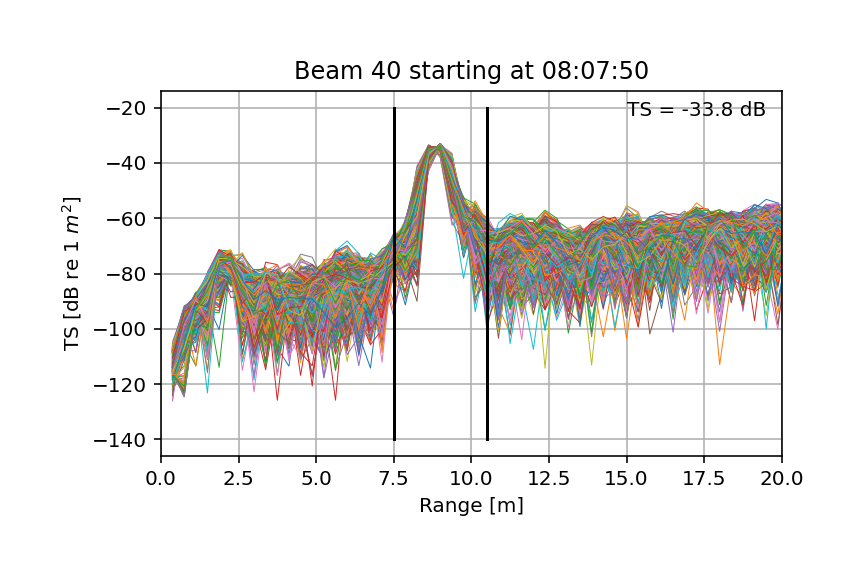

This repository contains several programs to assist with the calibration of ship-mounted fisheries omni-sonar systems that produce data in the SONAR-netCDF4 format. The programs are:
- [do_sonar_calibration.py](#sonarCal) - assists with real-time calibration
- [do_estimate_gains.py](#estimate-gains) - estimates gains from existing calibration data
- [do_add_calibration.py](#add-gains) - add calibration to existing sonar files
- [fix_furuno_files.py](#fix-furuno-files) - fix a problem with some Furuno omni-sonar files

# Installation

All of the programs can be run from the command line (e.g., Anaconda Prompt if under Windows). Some of the programs use configuration files - these should be in the same directory as the program itself. The programs all use Python3 and some additional libraries that may need to be added to your Python installation:
- numpy
- matplotlib
- scipy
- h5py
- netCDF4 
- pandas
- cftime
- humanize

# sonarCal
This program assists with the standard sphere calibration of omni-directional fisheries sonars. It provides a real-time display of sonar data that helps with moving a calibration sphere into the centre of a sonar beam.

## Usage

The program has one window:

 window")

The two range rings and radial line on the omni echogram can be moved with the mouse (click and drag)
to select the beam being calibrated and the range bounds of the calibration sphere. Changing these alters what is shown in the other echograms and plots.

Configuration of the program is done by editing the config file (called ``sonar_calibration.ini`` and located in the same directory as the program). The config parameters are:
- The directory where the sonar data files are created by the sonar (``watchDir``),
- The location of log files (``logDir``),
- The NetCDF4 group name for the horizontal sonar beams (``horizontalBeamGroupPath``),
- Whether to expect live data or whether to replay all the pings in the last file in ``watchDir`` (``liveData`` - set to ``yes`` or ``no``),
- The number of pings shown in the echograms (``numPingsToShow``),
- The maximum range of the echograms (``maxRange`` [m]), and
- The mininium and maximum Sv values used in the colormap (``minSv`` and ``maxSv`` [dB]).

# Estimate gains

This program calculates beam gain values from existing .nc files. It expects to be given a beam calibration file that lists start and stop times for when the calibration sphere is centered in particular beams, as well as the approximate range to the sphere. This file should be a csv-formatted file with column headers in the first row of ``start_time``, ``end_time``, ``beam_number``, and ``range``. The times should be in a format that the Python Pandas module can read. The range has units of metres. An example of such a file is:

```
start_time,end_time,beam_number,range
2021-06-08T8:07:50,2021-06-08T8:12:50,40,9
2021-06-08T8:18:40,2021-06-08T8:22:00,39,9
```

The program is configured by editing the config file (``gain_calibration.ini``, located in the same directory as the program). The parameters are:
- The directory that contains the .nc files (``datadir``),
- The directory to create log files in (``logdir``),
- The directory to store the results in (``resultsdir``),
- The directory and name of the beam calibration file (``callogfile``),
- The maximum range to show in the results plots (``maxrange`` [m]),
- The .nc beam group name to calculate the gains from (``beamgrouppath``),
- The TS of the calibration sphere (``spherets`` [dB re 1m<sup>2</sup>]), and
- The range window width to use when looking for the sphere echo (``rangewindowwidth`` [m]).


The program will step through each line in the .csv-formatted beam calibration file, find .nc files that contain pings in between ``start_time`` and ``end_time``, and for each ping choose the maximum echo close to ``range``. To remove outliers, the highest 5% and lowest 5% of these echoes are discarded and the linear mean of the remaining values are calculated and a gain correction derived by comparison to the sphere target strength. Per beam results are then written to the ``results.csv`` file in the results directory and a plot (see below) of the backscatter data produced for each beam. The results file is a copy of the beam calibration file with columns added thus:
- ``ts_mean`` - the mean target strength over all pings in the beam
- ``rs_rms`` - the root-mean-square between ``ts_mean`` and the individual sphere echoes
- ``ts_range`` - the mean range of the sphere backscatter over all pings in the beam
- ``ts_num`` - the number of sphere echoes used in the preceeeding values (this is after the removal of the uppper and lower 5% of the echoes)
- ``deltaGnew`` - the new deltaG value to use in the .nc file
- ``deltaGold`` - the deltaG value that was in the .nc file.



# Add gains

This program replaces the contents of the ``gain_correction`` variable in the SONAR-netCDF4 files with a user-speficied value. Configuration is done via the ``gain_calibration.ini`` file.

# Fix Furuno files

This program corrects a problem with files generated by Furuno omni-sonars where some of the vertical beam variables contain 128 beams when they should only have 64 beams. The need for this program will disappear with future versions of the Furuno software.